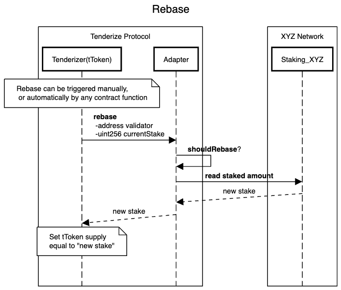

# Tenderize - Liquid Native Staking

The Tenderize protocol enables **liquid native staking**, each validator on a network can have its own permissionless
liquid staking vault and ERC20 token for itself and its delegators. It is designed to be fully credibly neutral and
autonomous, while enabling more flexibility to users when staking.

## Getting Started

## Usage

Here's a list of the most frequently needed commands.

### Build

Build the contracts:

```sh
forge build
```

### Clean

Delete the build artifacts and cache directories:

```sh
forge clean
```

### Compile

Compile the contracts:

```sh
forge build
```

### Coverage

Get a test coverage report:

```sh
forge coverage
```

### Deploy

For full deploy flow check out the [deploy document](./script/DEPLOY.md).

Deploy Tenderizer to Anvil:

```sh
$ forge script script/Tenderize_Deploy.s.sol:Tenderize_Deploy --fork-url http://localhost:8545 \
 --broadcast --private-key $PRIVATE_KEY
```

Deploy an Adapter to Anvil:

```sh
forge script deploy/2_Adapter.s.sol  --fork-url http://localhost:8545 \
 --broadcast --private-key $PRIVATE_KEY
```

For instructions on how to deploy to a testnet or mainnet, check out the
[Solidity Scripting tutorial](https://book.getfoundry.sh/tutorials/solidity-scripting.html).

### Format

Format the contracts:

```sh
forge fmt
```

### Gas Usage

Get a gas report:

```sh
forge test --gas-report
```

### Lint

Lint the contracts:

```sh
yarn lint
```

### Test

Run the tests:

```sh
forge test
```

## Modules

- [Tenderizer](): Liquid staking vault and rebasing ERC20 token
- [Unlocks](): ERC721 NFTs representing unstaked assets in their unstaking period
- [Adapter](): Interfaces for interacting with Adapters containing external protocol specific logic
- [Registry](): Registry and Role-Based access control
- [Factory](): Factory for deploying new Tenderizers for validators

### ERC1967 Storage

Tenderize contracts use [ERC1967](https://eips.ethereum.org/EIPS/eip-1967) storage slots. Each contract has its own
storage space defined as a `struct` stored at a defined location to avoid storage collisions. Storage slots are
addressed with a dollar sign, `$`, to improve readability when storage is accessed.

### Registry

The Registry keeps track of entities within the protocol. It is used to update things like `Adapter` for an asset, or
the fee for an asset. It also uses Role-based access control to manage roles. It is deployed as an ERC1967 UUPS.

### Tenderizer

#### Adapter interactions

A `Tenderizer` is a generic contract for Liquid Staking. Protocol specific logic is implemented in an `Adapter`. An
`Adapter` is essentially a contract that works similar to a library.

Each function on the `Adapter` is called by the `Tenderizer` using `delegatecall`, meaning the logic of the `Adapter` is
executed in context of the `Tenderizer`. An `Adapter` can have its own storage space, which is stored on the
`Tenderizer` contract, but can only be managed by the `Adapter`.

For view functions a workaround is used by marking the `internal` functions on the `Tenderizer` that interact with the
`Adapter` as `public` instead. Then creating a separate `external view` function that wraps a call to these functions in
a `staticcall` to the `Tenderizer` itself.

#### Clones with immutable args

Tenderizers are deployes as lightweight clones (proxies) with immutable argumants to avoid initialization logic and save
gas. Immutable arguments are appended to the clone's bytecode at creation time, and appended to the calldata on a
delegatecall to the proxy. The implementation can then read and deserialize these arguments from the calldata.

#### TenderToken

`Tenderizer` inherits the `TToken` contract, which is a rebasing ERC20 token. Its supply always equals the amount staked
in the underlying protocol for a validator and its delegators. Rebasing changes the total supply depending on whether
the validator earned rewards or got slashed.

### Unlocks

`Unlocks` is a ERC-721 NFT contract that represent staked assets in their unstaking period, meaning they have been
unstaked by their owner. Each unlock has an amount and a maturity date at which the amount can be withdrawn, this burns
the NFT. `Unlocks` is not upgradeable. All assets on the same network use the same `Unlocks` contract.

Only a valid `Tenderizer` contract can create or destroy Unlocks, which is checked by the `Unlocks` contract through the
`Registry`.

#### Renderer

The Renderer is a UUPS (ERC1967) upgradeable proxy contract that contains logic to how these NFTs and their JSON
metadata should be rendered by front-end applications, this data does not affect the value represented by the NFT in any
way.

### Sequence Diagrams

#### Deposit


#### Unlock


#### Withdraw


#### Rebase


